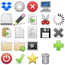

# JS Graphical App Builder

This app lets you build graphical applications in JavaScript, powered by **mujs** (lightweight JS engine) and **raylib** (graphics library).

---

## Core Functions Available

These functions provide essential interaction with the graphics, input, and UI systems:

### Window and Rendering

- **ClearBackground(color)**
  Clears the window background with the specified color.
  `color` is an object with `{r, g, b, a}` or `{r, g, b}` values (0-255).

- **DrawRectangleRec(rect, color)**
  Draws a filled rectangle.
  - `rect`: `{x, y, w, h}` — position and size
  - `color`: `{r, g, b, a}` color of the rectangle

- **ui_clear()**
  Clears the current UI state before rendering.

- **ui_compute(nodes)**
  Computes layout and other properties for the given UI nodes.

- **ui_draw(root_node)**
  Draws the UI starting from the given root node index.

- **ui_pick(x, y)**
  Returns the UI node id at the given mouse position `(x, y)`.

---

### Input

- **is_key_down(key_name)**
  Returns `true` if the specified key is currently held down.
  Example keys: `"space"`, `"left"`, `"right"`, `"up"`, `"down"`, etc.

- **is_key_pressed(key_name)**
  Returns `true` if the key was pressed (went down) in the current frame.

- **is_mouse_button_down(button_name)**
  Returns `true` if the specified mouse button is held down.
  Buttons: `"left"`, `"right"`, `"middle"`.

- **is_mouse_button_pressed(button_name)**
  Returns `true` if the mouse button was pressed this frame.

- **is_mouse_button_released(button_name)**
  Returns `true` if the mouse button was released this frame.

- **get_mouse_x()**
  Returns the current x-coordinate of the mouse cursor.

- **get_mouse_y()**
  Returns the current y-coordinate of the mouse cursor.

---

### Event Handling

You can create event objects with properties like:

- `name`: event type (`"mouse_pressed"`, `"mouse_released"`, etc.)
- `target`: UI node id affected by the event
- `mouse_x`, `mouse_y`: mouse coordinates during the event

These can be passed to your UI update logic.

---

### Color Utilities

- Colors are specified as objects `{r, g, b, a}` with values from 0 to 255.

---

## Notes

- The system uses a retained-mode UI approach — you build a model of UI elements and update/render them every frame.
- Mouse and keyboard input functions let you build interactive behavior easily.
- The app integrates raylib's drawing functions with a JS-driven UI model powered by mujs.

---

Feel free to extend and customize UI components using JSX-like tags (not covered here).

---

Happy building! 🚀


## UI featue

You can build easily ui with JSX tags and provide them to the ui func. Here a simple example

```jsx
var Button = function (props,children) {
  return <npatch
      id={props.id}
      class="fit m-2 p-2 min-y-200"
      x={props.x} y={props.y}
      color={props.color} r={props.r} g={props.g} b={props.b}
      src="ninepatch_button.png" left={16} right={16} top={16} bottom={16}
  >
    {children}
  </npatch>
};

var myui = func(props){
  return (
    <Button id="root" x={props.x} y={props.y} color={"#0F0"}>
      <Icon at_x={props.at_x} at_y={props.at_y}></Icon>
      <rectangle id="first" w={50} h={50} color={"#FFFF00"}></rectangle>
      <rectangle id="second" w={10} h={150} color={"#FFFF00"}></rectangle>
      </img>
      <txt msg="hello world" font_size={20} class="grow" text_v_align="middle" color="#000" ttf_font="pixantiqua.ttf"></txt>
    </Button>
  );
}

ui_clear();
ui_compute(myui({x:10,y:10,at_x:2,at_y:2}));
ui_draw(root_ui);
```

## Available JSX Tags and Their Properties

### `rectangle`

Draws a colored rectangle.

- `id`: string (optional)
- `x`, `y`: number (position)
- `w`, `h`: number or object `{ kind: "fit"|"grow", min?, max? }` (width and height)
- `color`: hex string (e.g. `"#FF0000"`) or object `{ r, g, b, a }`

---

### `img`

Draws an image.

- `src`: string (image file path)
- `x`, `y`, `w`, `h`: positioning and size (w/h support `"fit"` sizing)

---

### `npatch`

Draws a nine-patch image (stretchable borders).

- `src`: string (image path)
- `left`, `right`, `top`, `bottom`: number (padding for nine-patch borders)
- `x`, `y`, `w`, `h`: positioning and size
- `color`: color overlay (optional)

---

### `tile`

Draws a tile from a tileset (spritesheet).

- `src`: string (spritesheet image)
- `at_x`, `at_y`: number (tile coordinates in the spritesheet)
- `w`, `h`: number (tile display size)
- `tile_padding_x`, `tile_padding_y`: number (padding inside tilesheet)
- `tile_size_x`, `tile_size_y`: number (size of each tile in the spritesheet)

---

### `txt`

Draws text.

- `msg`: string (text content)
- `font_size`: number (font size)
- `color`: hex string or `{r,g,b,a}`
- `text_h_align`: `"b"` (begin), `"m"` (middle), `"e"` (end)
- `text_v_align`: `"b"` (begin), `"m"` (middle), `"e"` (end)
- `bmp_font`: string (bitmap font file path)
- `ttf_font`: string (TrueType font file path)
- `spacing`: number (character spacing, optional)
- `line_spacing`: number (line spacing, optional)

---

## Common Layout and Style Properties (on all tags)

- `x`, `y`: number — Position coordinates
- `w`, `h`: number or object — Width and height; can be fixed or `"fit"` or `"grow"` with bounds.
- `padding`: number — Uniform padding inside the element
- `margin`: number — Outer margin space
- `layout`: `"h"`, `"v"`, or `"s"` — Horizontal, vertical, or stack layout for children (default: horizontal)
- `h_align`: `"b"`, `"m"`, `"e"` — Horizontal alignment: begin, middle, end
- `v_align`: `"b"`, `"m"`, `"e"` — Vertical alignment: begin, middle, end
- `class`: string — space-separated style class names for custom behaviors and styling

---

## Color Format

Colors can be specified as:

- Hex strings: `"#RGB"`, `"#RRGGBB"`, or `"#RRGGBBAA"`
- Objects: `{ r: number, g: number, b: number, a?: number }` (0-255 values)

---

## Event Handling

Events passed to `ui.update()` have the form:

```js
{
  name: "mouse_pressed" | "mouse_released" | undefined,
  target: string, // node id
  mouse_x: number,
  mouse_y: number
}

---

## 🎨 Color Support

All visual tags (e.g., `rectangle`, `txt`, `npatch`) can accept color in **two ways**:

### 🟩 `color` (string)

A CSS-style hex color string, supporting multiple formats:

| Format       | Meaning                         |
|--------------|----------------------------------|
| `"#RGB"`     | 4-bit each (`#F0F`)              |
| `"#RRGGBB"`  | Standard 6-digit hex             |
| `"#RRGGBBAA"`| 8-digit hex with alpha           |

✅ Examples:

> color: "#FF0000"    // red
> color: "#0F0"       // green (short)
> color: "#336699FF"  // blue with full opacity

---

### 🟥 `r`, `g`, `b`, `a` (numbers)

Alternatively, use explicit color channels:

> r: 255
> g: 128
> b: 0
> a: 255

---

## 📏 Size (`w`, `h`)

Size can be **fixed** or **flexible** via:

### 1. **Fixed Pixel Size**

> w: 200
> h: 100

### 2. **Fit / Grow Objects**

Define an object instead of a number:

> w: { kind: "fit", min: 0, max: 300 }
> h: { kind: "grow", min: 100, max: 500 }

| Kind    | Behavior                        |
|---------|---------------------------------|
| `"fit"` | Shrink to fit child content     |
| `"grow"`| Expand within bounds            |

If no bounds are given, defaults to 0 for both `min` and `max`.

---

## 🧭 Position

| Property | Type   | Description             |
|----------|--------|-------------------------|
| `x`      | number | X-position (absolute)   |
| `y`      | number | Y-position (absolute)   |

---

## 🧱 Layout

| Property   | Type   | Values                | Description                         |
|------------|--------|-----------------------|-------------------------------------|
| `layout`   | string | `"h"` / `"v"` / `"s"` | Layout: horizontal, vertical, stack |
| `padding`  | number |                       | Inner padding                       |
| `margin`   | number |                       | Outer margin                        |

---

## 🎯 Alignment

### Node Alignment

| Property     | Values                 | Description                         |
|--------------|------------------------|-------------------------------------|
| `h_align`    | `"b"` / `"m"` / `"e"`  | Horizontal: begin, middle, end      |
| `v_align`    | `"b"` / `"m"` / `"e"`  | Vertical: begin, middle, end        |

### Text Alignment (for `<txt>`)

| Property        | Values               | Description                         |
|------------------|----------------------|-------------------------------------|
| `text_h_align`   | `"b"` / `"m"` / `"e"`| Text horizontal alignment           |
| `text_v_align`   | `"b"` / `"m"` / `"e"`| Text vertical alignment             |

---

## 💡 Size & Layout Strategy Summary

| Kind         | Format                              | Purpose                        |
|--------------|--------------------------------------|--------------------------------|
| Fixed size   | `w: 100`                             | Direct pixel control           |
| Fit to child | `w: { kind: "fit" }`                 | Shrinks to content             |
| Grow         | `w: { kind: "grow", min, max }`      | Expands to available space     |
| Layout       | `layout: "h"` or `"v"`               | Stacks children accordingly    |

---

## 📦 Class System (via `class`)

Supports both:

- **Static class names** (e.g., `m-2`, `p-2`, `fit`)
- **Pattern-matched values** (e.g., `m-10`, `min-w-100`), dynamically handled via regex matchers.

These classes are space-separated:

```
class: "m-2 p-4 fit grow"
```

They are parsed and handled via:
- `init_node_fn` table for known class names
- `array_init_node_fn1` regex patterns for dynamic behaviors
